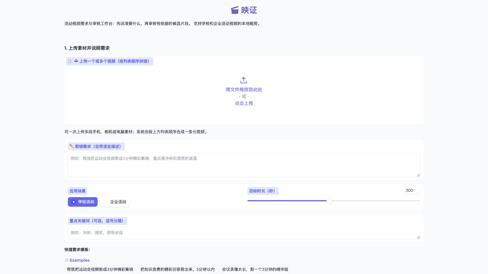

# 映证｜可审核的 AI 剪辑决策 Harness

映证面向学校与企业活动视频：它先分别理解每段原素材，再把模糊要求变成有证据、可修改、可批准的剪辑任务书和时间线。操作者可以在本机生成 MP4 预览，也可以把同一批准版本交给剪映或支持 OTIO 的专业剪辑流程继续精修。

一句话区别：剪辑软件解决“怎么剪”，映证重点解决“素材里剪什么、为什么这样剪、谁确认过，以及怎样把决定可靠交给剪辑软件”。



[改造执行计划](docs/editing-harness-refactor-plan.md) · [系统架构](docs/architecture.md) · [产品需求](docs/PRD.md) · [技术方案](docs/technical-plan.md) · [用户验证方案](docs/real-user-validation.md)

## 当前已实现

- 一次上传一段或多段视频；每段素材独立预检、中文转录、摘要和索引，不在分析前拼成长视频。转录、证据、候选和时间线均保留“来源文件 + 原文件时间”。
- 素材优先的需求分析：LLM 结合转录证据提出业务问题，展示提问原因和影响；用户可以逐题补充或忽略，不需要填写时间码。AI 只能建议，不能静默覆盖任务书。
- BM25 + Embedding/RRF 混合检索。BM25 负责姓名、奖项、产品名等精确词，向量检索补充语义近似表达；候选 Agent 按单项需求分批调用工具，单批失败不会拖垮全部分析。
- 证据化候选：模型只返回紧凑选择，引用、需求关联和分数由代码补齐；候选需要通过来源、时间范围、引文近似匹配和完整表达检查，规则降级结果不能冒充合格 AI 候选进入正式成片。
- 确定性时长预算、必须项覆盖、候选多样性排序、问答上下文保护和短版人工例外。页面会说明当前还差多少秒以及应补哪类内容。
- 电脑审核页可预览候选、保留或删除、排序、修改字幕与标题，并从指定原素材拖动范围补片；高级视觉设置保持折叠。
- 活动流程表、主持稿、人员/职务/奖项名单、产品和术语资料可成为带文件位置的辅助证据；疑似姓名或专有名词修正进入人工确认队列，不会静默改写 ASR。
- 通用 `CanonicalTimeline` 是跨执行器事实来源。同一批准时间线可生成 FFmpeg MP4、剪映稳定交接包（顺序片段、SRT、CSV、JSON、说明）和 OTIO 时间线。
- 手机轻量审核页支持短期链接、二维码、过期、撤销、版本绑定和幂等提交；它只用于批准或退回，不是手机剪辑器。
- 状态、任务书、计划、用户决定、模型调用元数据、重试原因和验收报告均版本化并可恢复。Embedding、单素材、单需求批次和编辑器 Adapter 彼此隔离失败。
- 本地 JSON/JSONL 是默认事实存储；可选 PostgreSQL 保存任务索引，Redis 提供跨进程幂等键和任务锁。仓库包含 Docker Compose 与健康检查。
- 组织品牌、专有名词、模板规则和发布限制具备版本化配置服务；每条规则都有来源和删除状态。

## 明确边界

- 映证不是自研完整多轨剪辑器，也不依赖 Codex、MCP 或 UI 自动化操作剪辑软件。
- 剪映适配采用公开、稳定的文件交接包，不写私有草稿格式；导入后仍需在剪映中选择模板或完成专业精修。
- 当前主要理解中文语音和文字证据，不包含成熟的视觉事件识别、多机位同步、自动择镜、自动配乐、口型级剪辑或复杂调色。
- 无音轨素材可以人工补入，但当前不会仅凭画面自动理解内容。
- 不承诺无人审核的正式交付。高风险姓名、职务、奖项、产品名和发布限制仍由人确认。
- PostgreSQL/Redis 是可替换部署边界，视频、预览和大产物仍保存在本地或受控文件存储中。

## macOS 快速开始

```bash
brew install ffmpeg
python3 -m venv .venv
.venv/bin/pip install -r requirements.txt
cp .env.example .env
# 在 .env 中填写 LLM_API_KEY；Embedding 可以使用单独的兼容服务
.venv/bin/python run.py --ui
```

浏览器访问终端显示的地址。推荐流程：上传独立素材 → AI 理解素材并生成任务书/追问 → 逐题确认 → 检索候选 → 审核证据和时间线 → 本机生成，或交给手机审核 → 查看逐项验收 → 下载剪映交接包或 OTIO。

需要手机审核时，另开一个终端运行：

```bash
.venv/bin/python run.py --mobile-review
```

同一台电脑测试可保留 `MOBILE_REVIEW_BASE_URL=http://127.0.0.1:7961`。真实手机需要把它改成电脑的局域网地址，例如 `http://192.168.1.20:7961`，并保证两台设备网络互通。

容器化启动：

```bash
docker compose up --build
```

Web 工作台默认位于 `http://127.0.0.1:7860`，手机审核服务默认位于 `http://127.0.0.1:7961`。

## 主要配置

| 变量 | 默认值 | 用途 |
| --- | --- | --- |
| `LLM_API_KEY` | 无 | 需求编译、素材访谈、候选工具调用、样式理由和保守字幕校对 |
| `LLM_BASE_URL` | OpenAI API | OpenAI-compatible 服务地址 |
| `LLM_MODEL` | `gpt-4o-mini` | 聊天模型 |
| `LLM_TIMEOUT_SECONDS` | `60` | 单次 LLM/Embedding 超时 |
| `EMBEDDING_API_KEY` | 无 | 留空时仅使用 BM25；也可使用独立 Embedding 服务 |
| `EMBEDDING_BASE_URL` | OpenAI API | Embedding 服务地址 |
| `EMBEDDING_MODEL` | `text-embedding-3-small` | 向量召回模型 |
| `WHISPER_MODEL_SIZE` | `small` | 可评估 `large-v3` 提高中文识别质量 |
| `WHISPER_DEVICE` | `cpu` | macOS 默认 CPU |
| `WHISPER_COMPUTE_TYPE` | `int8` | CPU 推理配置 |
| `VIDEO_ENCODER` | `h264_videotoolbox` | 不可用时改为 `libx264` |
| `GRADIO_SERVER_PORT` | 自动选择 | 电脑审核页端口 |
| `MOBILE_REVIEW_BASE_URL` | `http://127.0.0.1:7961` | 二维码和手机审核链接使用的可访问地址 |
| `DATABASE_URL` | 空 | 可选 PostgreSQL 任务索引 |
| `REDIS_URL` | 空 | 可选 Redis 幂等键、任务锁和缓存 |

## 验证

```bash
.venv/bin/python -m pytest -q
.venv/bin/python scripts/run_eval.py
.venv/bin/python -m ruff check src tests
```

自动测试覆盖独立素材与局部失败、需求版本和 AI 追问、状态机幂等与恢复、混合检索、引用校验、完整表达边界、时长预算、通用时间线、剪映/OTIO 导出、辅助资料、组织配置、手机审核、渲染与逐项验收。

离线评测集包含学校和企业各 3 个任务，报告 BM25/RRF/Rerank 的 Recall@K、MRR/NDCG、延迟、引用有效率和幻觉率，并新增完整表达、问答上下文、时长误差、候选重复率、活动结构覆盖、需求覆盖和来源追溯指标。真实用户验证仍用于判断产品价值、默认参数和后续优先级，但不阻塞已经明确的 V1.1 工程能力，也不能在没有数据时被用来宣称节省时间或减少返工。
