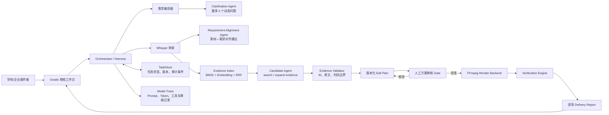

# 映证 MVP2 系统架构

映证不是让 LLM 直接调用 FFmpeg 的“全自动剪辑 Agent”。Orchestrator 作为 Harness 控制上下文、工具权限、版本和人工 Gate；模型只生成建议，确定性服务负责引用校验、状态迁移、计划批准和交付验收。

## 关键工程边界

- LLM 不能直接修改任务状态、批准计划或触发正式渲染。
- 候选 Agent 只能看到受限工具返回的证据窗口，不能读取未授权的完整转录。
- 引文、需求关联和检索分数由代码根据证据 ID 补齐并验证，不信任模型自由字段。
- 用户修改任务书或剪辑计划会生成新版本，使依赖旧版本的批准失效。
- FFmpeg 是可替换执行后端；产品核心是需求编译、证据审核、人工决策和验收闭环。
