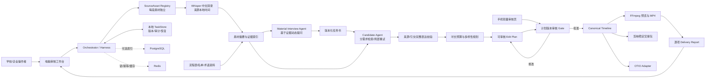

# 映证 Editing Harness 系统架构

映证不让 LLM 直接控制剪映或 FFmpeg。Harness 负责上下文、工具权限、版本、状态、失败恢复和人工 Gate；模型只提出有证据的建议，确定性代码负责来源、引用、时间、时长和交付校验。



## 核心数据事实

```text
SourceAsset
  └─ source_asset_id + source-local time
       ├─ TranscriptSegment
       ├─ Evidence
       ├─ CandidateClip
       └─ CanonicalTimelineClip
```

多素材在分析前不会被拼成长视频。只有用户批准 `CanonicalTimeline` 后，执行器才按顺序从各原文件取段并组合预览、成片或交接包。

## 关键工程边界

- LLM 不能直接改变任务状态、批准计划或触发正式渲染。
- 素材访谈和候选 Agent 只能通过受限工具读取相关证据窗口，不能默认反复接收全部长转录。
- 引文、需求映射、来源和检索分数由代码根据证据 ID 补齐并校验，不信任模型自由生成的“证据字段”。
- BM25 保护中文姓名、奖项和产品名的精确召回，Embedding 补充不同措辞的语义召回，RRF 避免一侧高分结果丢失。
- 单素材、单需求候选批次和单 Adapter 独立失败与重试；已经完成的转录和索引不会因无关修改重复生成。
- 用户修改任务书或剪辑计划会生成新版本，并使依赖旧版本的批准和手机链接失效。
- 手机端只审核绑定版本；令牌保存哈希，具备过期、撤销和幂等提交。
- FFmpeg、剪映交接包和 OTIO 都消费同一个批准时间线。Adapter 失败不得污染任务书或批准状态。
- 本地文件是单机默认事实来源；PostgreSQL/Redis 是可选部署能力，不把数据库变成使用 MVP 的前置条件。
